# UniG2U-Bench 论文解读：统一多模态模型真的提升了视觉理解吗？

> 论文标题：UniG2U-Bench: Do Unified Models Advance Multimodal Understanding?
>
> 论文链接：https://arxiv.org/abs/2603.03241
>
> 作者：Zimo Wen, Boxiu Li, Wanbo Zhang, Junxiang Lei, Xiaoyu Chen, Yijia Fan, Qi Zhang, Yujiang Wang, Lili Qiu, Bo Li, Ziwei Liu, Caihua Shan, Yifan Yang, Yifei Shen†
>
> 机构：Microsoft Research Asia、上海交通大学、南洋理工大学、复旦大学、牛津大学
>
> 日期：2026年3月5日

## 一、引言：统一模型的"美丽幻觉"

过去一年，多模态领域最引人注目的趋势莫过于"统一建模"（Unified Multimodal Modeling）——将视觉理解和视觉生成整合到同一个模型中。从 2024 年底的 Emu3、Janus-Pro，到 2025 年的 Bagel、Show-o2、ILLUME+，再到最近的 OmniGen2、MammothModa2，统一多模态模型（Unified Multimodal Models, UMMs）如雨后春笋般涌现。

这些工作背后有一个直觉性的假设：**既然模型能生成高质量的图像，它对视觉世界的"理解"一定也更深刻了**。就像一个能够逼真描绘光影、透视和空间关系的画家，理应比普通人更擅长解读视觉场景。

但真的是这样吗？

来自微软亚洲研究院、上海交通大学、南洋理工大学等机构的研究团队对这个假设进行了系统性的实证检验，推出了 **UniG2U-Bench**——一个包含 3000 个样本、覆盖 7 大类别和 30 个子任务的综合性基准，专门用来评估"生成能力是否以及何时有助于视觉理解"这一核心问题。

实验结果出人意料地"残酷"：**统一模型在绝大多数理解任务上反而不如其对应的纯理解基座模型（Base VLM），生成能力的引入更像是一种"统一税"（Unification Tax）而非免费午餐。** 然而故事并不止于此——在特定类型的空间推理和视觉错觉任务中，生成能力确实带来了结构性的增强，而"先生成再回答"（Generate-then-Answer）策略在迷宫导航、滑动拼图等需要多步状态追踪的任务中展现出了"视觉思维链"的潜力。

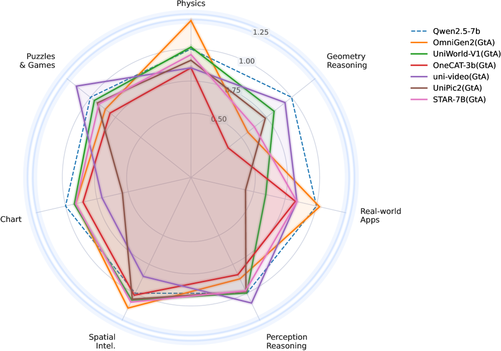

*图1：UniG2U-Bench 的 GtA（Generate-then-Answer）推理结果雷达图。展示了多个统一模型在 7 大任务类别上相对于 Qwen2.5-VL-7B 基线的表现。可以看到，大多数模型在多数维度上未超越基线，但在空间智能（Spatial Intelligence）等个别维度上出现了突破。*

## 二、为什么需要 UniG2U-Bench？

### 2.1 现有评测的盲区

在 UniG2U-Bench 之前，已经有几个面向统一模型的评测基准：

| 基准 | 理解样本数 | 子任务数 | 是否评估协同效应 |
|:---|:---:|:---:|:---:|
| MME-Unify | 1964 | 3 | ✗ |
| Uni-MMMU | 524 | 4 | ✓ |
| ROVER | 404 | 6 | ✓ |
| RealUnify | 400 | 4 | ✓ |
| **UniG2U-Bench (本文)** | **3000** | **30** | **✓** |

这些先前工作存在三个关键不足：

1. **任务覆盖面窄**：最多只有 6 个子任务，难以细粒度地揭示生成能力在不同推理模式下的影响差异
2. **缺乏系统性的任务-模型交叉分析**：未能回答"哪些类型的任务从生成能力中受益、哪些反而受损"这一关键问题
3. **未考察中间生成物的质量与最终理解之间的因果关系**：模型生成了中间图像之后答题效果变好或变差，但背后的原因是什么？

UniG2U-Bench 正是为填补这些空白而设计的。

### 2.2 四个核心研究问题

论文围绕四个精心设计的研究问题（Research Questions）展开全部实验：

- **RQ1**：统一模型 vs. 基座模型——生成能力的引入是提升还是削弱了理解能力？
- **RQ2**：直接推理 vs. 先生成再回答（GtA）——显式地生成中间视觉制品是否有帮助？
- **RQ3**：不同任务类型和模型架构之间的 G2U 增益是否存在相关性和聚类模式？
- **RQ4**：中间生成物的对齐质量与最终理解性能之间是什么关系？

## 三、UniG2U-Bench 的设计

### 3.1 任务体系：7 大类别，30 个子任务

UniG2U-Bench 的核心设计原则是：**覆盖从感知到推理的完整光谱，且每个任务都需要不同程度的隐式或显式视觉变换**。这使得基准能够精准地探测生成能力在何处有益、何处有害。

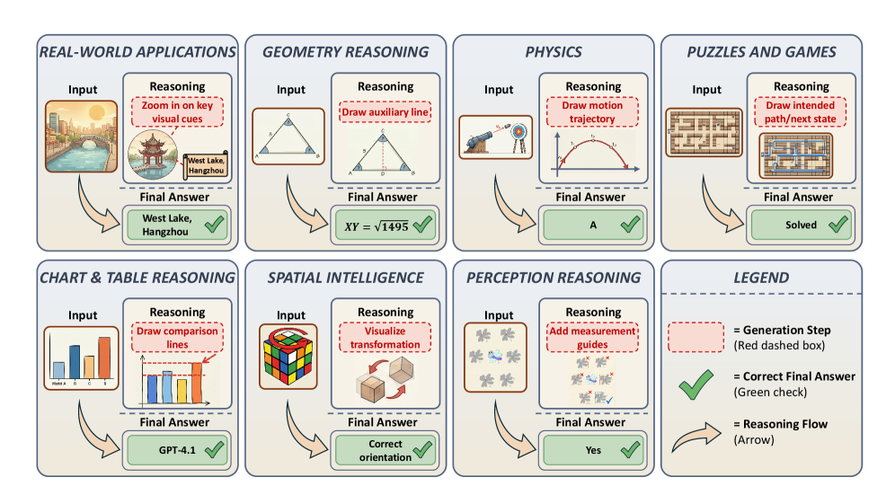

*图2：UniG2U-Bench 的 7 大任务类别及其样例。每个类别展示了输入图像、生成推理中间步骤和最终答案。从实际应用到感知推理，任务复杂度和对视觉变换的需求层层递进。*

七大类别的具体构成如下：

| 类别 | 子任务 | 样本数 | 数据来源 |
|:---|:---|:---:|:---|
| 现实世界应用 | 注意力聚焦、视觉最短路径 | 200 | VSP, RealUnify |
| 几何推理 | 平面几何、立体几何 | 200 | Geometry3K, AuxSolidMath |
| 物理推理 | 力学、光学 | 200 | PhyX |
| 谜题与游戏 | 心理重建、心理追踪、视觉追踪、迷宫、拼图、滑动拼图 | 537 | Uni-MMMU, RealUnify, BabyVision |
| 图表推理 | 图表问答 | 100 | ChartQA |
| 空间智能 | 多步空间推理(MSR)、属性测量、属性近似、相机运动、物体运动 | 500 | MMSI-Bench |
| 感知推理 | 图标场景/形状、内嵌场景/形状、Logo场景/形状、算法/演绎/空间/类比/归纳推理 | 1263 | IllusionBench, Visual Puzzles, BabyVision |
| **合计** | **30 个子任务** | **3000** | **多源** |

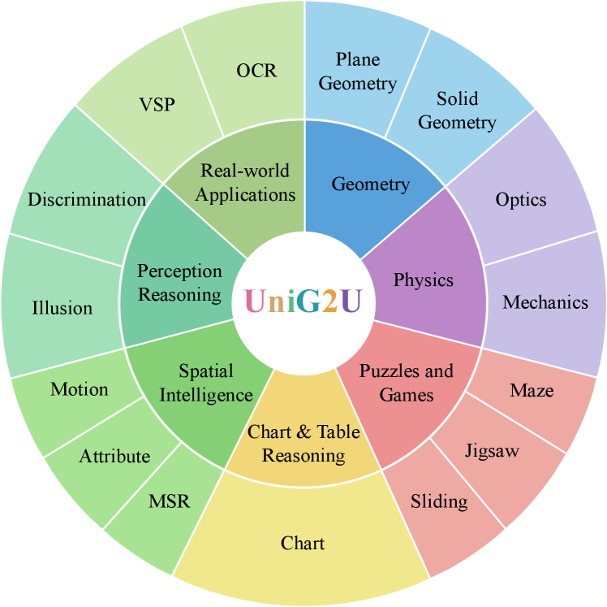

*图3：UniG2U-Bench 的任务分类轮盘图。外圈展示 30 个细粒度子任务，内圈为 7 个一级类别。任务覆盖面远超既有基准。*

值得注意的是，感知推理类别独占了 1263 个样本（42%），因为视觉错觉和感知欺骗是检验模型是否真正"理解"视觉结构（而不仅仅是做模式匹配）的试金石。

### 3.2 评估协议：直接推理 vs. 先生成再回答（GtA）

论文定义了两种推理协议来对比生成能力的实际影响：

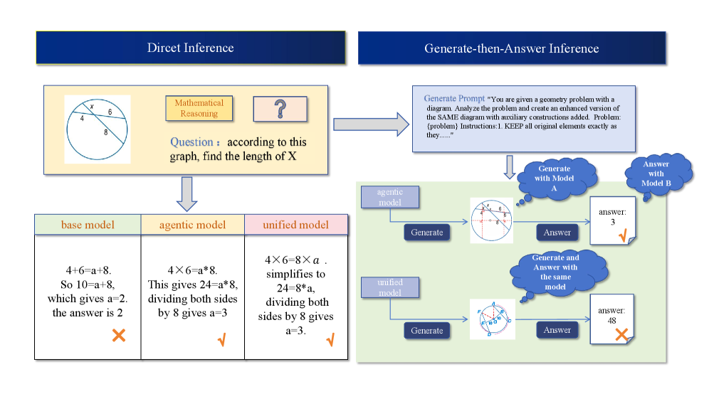

*图4：直接推理（Direct Inference）与"先生成再回答"（Generate-then-Answer, GtA）两种推理协议的对比。Direct 模式直接从输入得到答案；GtA 模式先让模型生成中间图像（如变换后的场景、标注示意图），再基于原始输入和中间图像联合回答。*

- **Direct Inference**：标准的视觉问答流程，模型直接根据输入图像和问题给出答案
- **Generate-then-Answer (GtA)**：模型首先根据问题生成一张或多张中间图像（如标注关键信息、可视化推理过程），然后基于原始图像和生成图像共同回答问题

GtA 的设计灵感来源于一个直觉：**如果生成能力真的增强了理解，那么让模型先"画出来"应该能帮助它更好地推理**——就像人类在解几何题时画辅助线、在走迷宫时标记路径一样。

### 3.3 核心度量指标

#### G2U 增益（Generation-to-Understanding Gain）

定义为统一模型与其对应基座 VLM 的理解性能差：

$$\Delta_{G2U} = \text{Acc}_{UMM} - \text{Acc}_{BaseVLM}$$

正值意味着生成训练提升了理解能力，负值则表示引入了"统一税"。

#### RA 和 AL 对齐度量

论文还创新性地引入了两个诊断性指标来评估 GtA 中间生成物的质量：

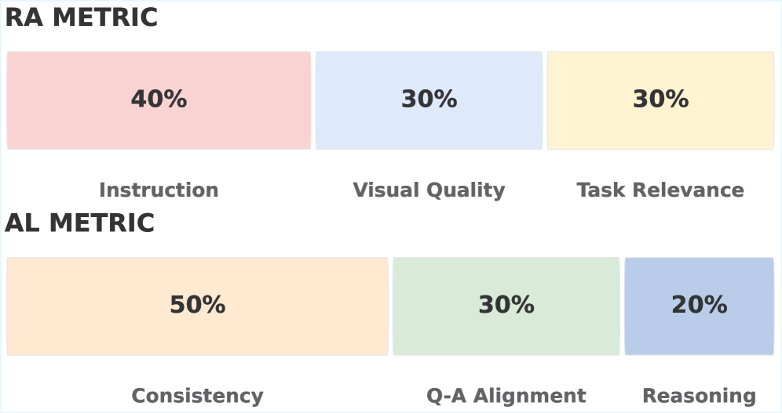

*图5：RA（Reasoning-to-Visual Alignment）和 AL（Answer-to-Visual Alignment）两个对齐度量的权重分布。RA 衡量生成图像对推理指令的遵循程度（指令遵循 40%、视觉质量 30%、任务相关性 30%）；AL 衡量最终答案与生成图像的逻辑一致性（一致性 50%、问答对齐 30%、推理质量 20%）。*

- **RA（Reasoning-to-Visual Alignment）**：生成的中间图像是否忠实地执行了推理指令？权重分配为：指令遵循度 40%、视觉质量 30%、任务相关性 30%
- **AL（Answer-to-Visual Alignment）**：最终答案是否与生成的中间图像在逻辑上保持一致？权重分配为：一致性 50%、问答对齐 30%、推理质量 20%

这两个指标可以帮助我们拆解 GtA 的成败原因——是生成质量不行（RA 低），还是生成的东西虽然好看但模型没有正确利用（AL 低）？

### 3.4 评估模型阵容

论文的评估规模在同类工作中堪称最大：

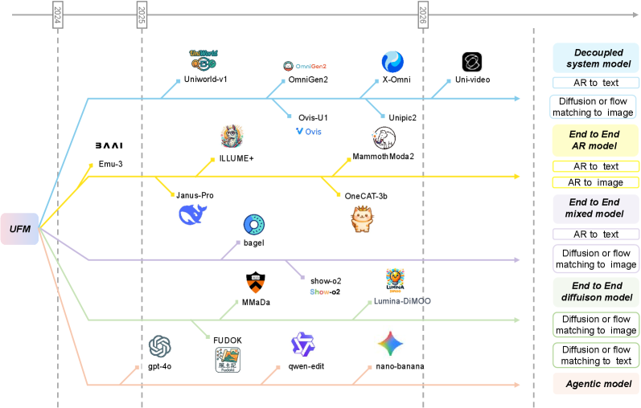

*图6：统一多模态模型的发展时间线和分类学。模型按架构类型分为三大阵营：解耦系统模型（Decoupled）、端到端模型（End-to-End，含自回归 AR、混合、扩散三个子类）、以及智能体模型（Agentic）。时间跨度从 2024 年到 2026 年初。*

整体评估涵盖 **35+ 个模型**，包括：

- **11 个基座 VLM**：Qwen2.5-VL-7B、Qwen2.5-VL-3B、LLaVA-OneVision、DeepSeek-V2 等
- **21 个统一模型**：Bagel、Janus-Pro、Show-o2、ILLUME+、OmniGen2、Ovis-U1、MMaDA、MammothModa2、OneCAT-3B 等
- **3 个智能体/组合模型**：GPT-4o + GPT-image、Gemini Pro + Nano Banana Pro、Qwen2.5 + Qwen-Edit

模型架构的多样性也是一大亮点。论文系统地整理了统一模型的分类学（Table 3），涵盖了：
- **端到端 AR 模型**（如 Janus-Pro、OneCAT-3B）
- **端到端 Flow 模型**（如 Bagel、Show-o2）
- **端到端离散扩散模型**（如 MMaDA、Lumina-DiMOO）
- **解耦系统模型**（如 OmniGen2、UniWorld-V1、Ovis-U1）

这种多样性使得我们可以系统性地回答"架构选择对 G2U 增益的影响"这一关键问题。

## 四、核心实验结果

### 4.1 RQ1：统一模型普遍"缴税"

这是论文最核心也最令人清醒的发现——**绝大多数统一模型在理解能力上不如其基座 VLM**。

下面是主要结果的精选对比（完整数据见 Table 4）：

| 模型 | 基座模型 | Overall（Direct） | G2U 增益 Δ |
|:---|:---|:---:|:---:|
| qwen2.5-vl-7b* （基座） | — | 34.45 | 0.00 |
| OmniGen2 | qwen2.5-vl-7b | 31.99 | **-2.46** |
| OneCAT-3B | qwen2.5-vl-7b | 31.15 | **-3.30** |
| STAR-7B (GtA) | qwen2.5-vl-7b | 32.68 | **-1.77** |
| Bagel | llava-onevision | 35.84 | **+2.49** |
| Bagel (GtA) | llava-onevision | 36.10 | **+2.75** |
| Show-o2 | llava-onevision | 31.59 | **-1.76** |
| Janus-Pro | deepseek-v2 | 27.39 | **+1.53** |
| AIA | deepseek-v2 | 28.65 | **+2.79** |
| MMaDA | LLaDA-Instruct | 21.09 | **+4.04** |
| MammothModa2 | Qwen3-VL-8B | 29.97 | **-7.78** |
| Ovis-U1 | Qwen2.5-VL-3B | 32.15 | **-0.24** |
| Ovis-U1 (GtA) | Qwen2.5-VL-3B | 24.19 | **-8.20** |

几个关键观察：

**第一，"统一税"是普遍现象。** 在 21 个统一模型中，大约三分之二的模型在 Overall 上低于其基座。最极端的案例是 MammothModa2——尽管基于强大的 Qwen3-VL-8B（37.75），统一后骤降至 29.97，损失了 **7.78 个百分点**。这说明联合训练中生成目标对判别式理解的干扰是实质性的。

**第二，少数模型逆势上扬。** Bagel 以 +2.49/+2.75（Direct/GtA）的 G2U 增益成为开源统一模型中的最大赢家；MMaDA 以 +4.04 的增益名列前茅，但需要注意其基座模型 LLaDA-Instruct 本身很弱（17.05），绝对性能仍然不高。Janus-Pro（+1.53）和 AIA（+2.79）也展示了正向增益。

**第三，GtA 推理通常让事情变得更糟。** 对比 Direct 和 GtA 两种协议，Ovis-U1 从 32.15 暴跌至 24.19（GtA 的 G2U Δ 达 -8.20），Show-o2 从 31.59 跌至 26.59（Δ = -6.76），ILLUME+ 从 29.54 跌至 27.13（Δ = -6.22）。这表明，低质量的中间生成物不仅无助于推理，反而引入了"上下文污染"——错误的视觉信息会误导后续的答题模块。

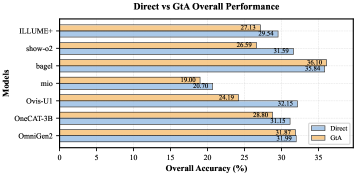

*图7：各模型在 Direct 和 GtA 两种推理协议下的总体性能对比柱状图。蓝色为 Direct，橙色为 GtA。绝大多数模型中 GtA 低于 Direct，少数例外集中在特定模型（如 Bagel）。*

**第四，智能体组合模型遥遥领先。** Gemini Pro + Nano Banana Pro 以 60.80 的 Overall 远超所有端到端统一模型和纯 VLM，说明"管道化专家组合"在当前仍然是性能上限。GPT-4o 单体以 38.96 位居纯模型之首。

### 4.2 RQ2：GtA 在哪些任务中真正有效？

虽然 GtA 的总体表现令人失望，但论文发现了**三个生成友好型（Generation-Friendly）子任务**，在这些场景下 GtA 展现出了一致且显著的提升：

| 模型 | MSR (Dir → GtA) | 迷宫 (Dir → GtA) | 滑动拼图 (Dir → GtA) |
|:---|:---|:---|:---|
| OmniGen2 | 0.220 → **0.290** | 0.043 → 0.046 | 0.000 → 0.001 |
| OneCAT-3B | 0.320 → **0.390** | 0.084 → 0.074 | 0.112 → 0.031 |
| Ovis-U1 | 0.120 → **0.270** | 0.134 → 0.003 | 0.334 → 0.007 |
| MIO | 0.210 → **0.320** | 0.000 → 0.000 | 0.000 → 0.000 |
| **Bagel** | 0.260 → 0.250 | 0.021 → **0.281** | 0.009 → **0.195** |
| Show-o2 | 0.270 → **0.300** | 0.142 → **0.178** | 0.137 → **0.183** |
| ILLUME+ | 0.280 → **0.290** | 0.069 → **0.129** | 0.040 → 0.000 |

这三个任务有一个共同特征：**都需要多步空间状态变换和追踪**。

- **多步空间推理（MSR）**：需要在脑中执行一系列空间变换后判断最终状态
- **迷宫导航（Maze）**：需要在复杂路径中规划并追踪移动轨迹
- **滑动拼图（Sliding）**：需要模拟多步滑块移动后的最终布局

在这些场景中，GtA 的中间生成物充当了**"外部认知工作空间"**——模型不需要在内部记忆中追踪所有中间状态，而是将状态变换的结果"画出来"，大幅降低了工作记忆的负担。论文将这种效应称为**"视觉思维链"（Visual Chain-of-Thought）**。

Bagel 在这类任务上的表现尤为亮眼：迷宫任务从 2.1% 飙升至 **28.1%**（13 倍提升），滑动拼图从 0.9% 跃升至 **19.5%**（21 倍提升）。这说明当模型的生成质量足够好，且任务本身需要多步状态外化时，GtA 确实能够解锁巨大的性能潜力。

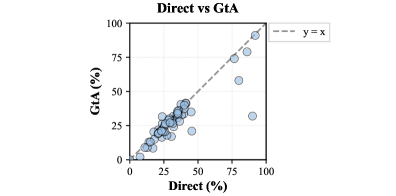

*图8：各模型 Direct 和 GtA 准确率散点图，y=x 参考线以上表示 GtA 优于 Direct。可以看到大部分散点落在参考线以下（GtA 较差），但部分模型-任务组合出现了显著的 GtA 增益（散点远离参考线上方）。*

然而，一个反直觉的发现是：**即使在理论上应该受益于视觉辅助的几何推理和物理推理任务中，GtA 也普遍失效。** 原因在于这些任务对中间图像的精度要求极高——几何题的辅助线角度稍有偏差就可能导致完全错误的推理，而当前模型的生成精度远达不到这一要求。

### 4.3 RQ3：任务和模型的相关性分析

论文使用 Spearman 秩相关系数进行了深入的交叉相关分析，揭示了两个层面的结构性模式。

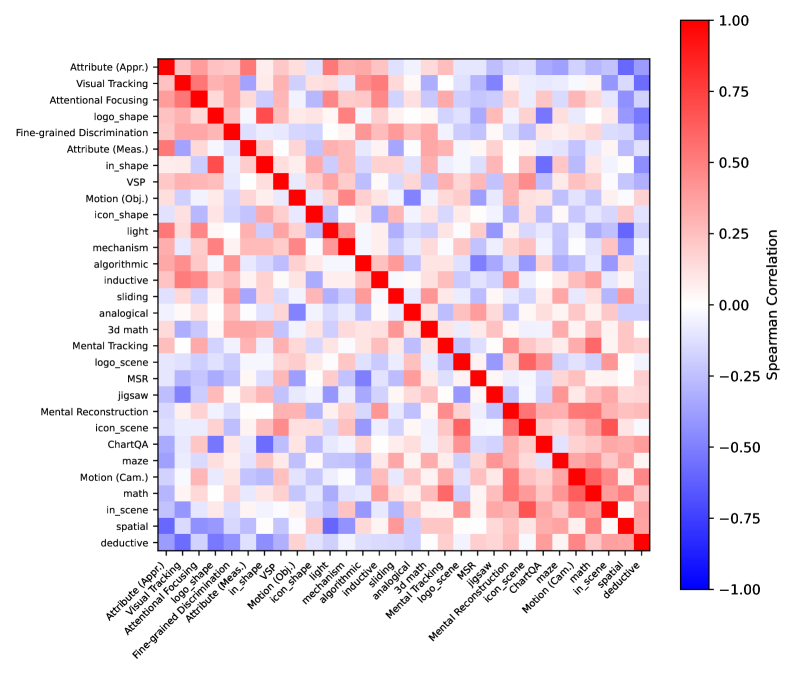

*图9：30 个子任务之间的 G2U 增益 Spearman 相关性热力图。相近任务（如感知推理内部的各子任务）呈现高度正相关，而感知类与推理类任务之间呈现负相关——生成能力在感知和推理上存在此消彼长的"跷跷板效应"。*

**任务层面的发现：**

1. **感知型任务内部高度正相关**：图标识别、Logo 检测、内嵌形状等感知类子任务之间的 G2U 增益强相关。这意味着，如果生成训练增强了模型对视觉结构的敏感度，这种增强是系统性的，而非偶然的。
2. **推理型任务内部也高度正相关**：几何推理的平面和立体子任务、物理推理的力学和光学子任务之间表现出一致的行为模式。
3. **感知与推理之间存在跷跷板效应**：当某个模型在感知类任务上获得 G2U 正增益时，它在推理类任务上往往出现负增益，反之亦然。这强烈暗示生成训练引入的归纳偏置在感知和推理两种能力之间存在**根本性的权衡（trade-off）**。

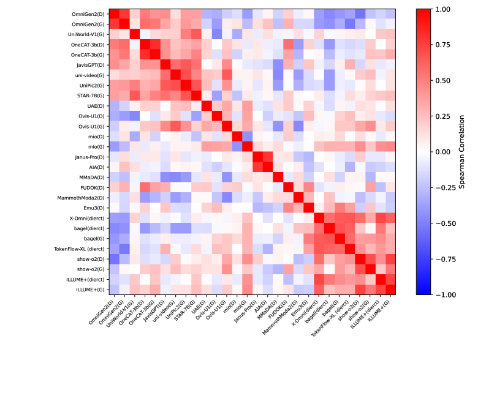

*图10：模型间 G2U 增益的 Spearman 相关性热力图。基于相同基座 VLM 的统一模型（如都基于 Qwen2.5-VL 的 OmniGen2、OneCAT-3B、STAR-7B 等）表现出极强的行为正相关，而不同基座的模型相关性较弱。*

**模型层面的发现：**

1. **基座模型才是决定性因素**：共享相同基座 VLM 的统一模型表现出极强的行为相关性，远强于仅共享生成架构（如都用 AR 或都用扩散）的模型之间的相关性。例如，基于 Qwen2.5-VL 的 OmniGen2、OneCAT-3B、UniWorld-V1 等模型的 G2U 增益模式高度一致。
2. **架构选择的影响被高估了**：社区中关于"AR vs 扩散"、"端到端 vs 解耦"等架构论战的激烈程度，可能远超其实际影响——基座模型的表征先验和预训练数据分布才是决定 G2U 行为的主导因素。
3. **预训练数据比架构更重要**：这一发现的实践意义在于，与其花大力气设计新的统一架构，不如投入更多精力在策划高质量的理解-生成联合训练数据上。

### 4.4 RQ4：中间生成物的质量解剖

论文通过 RA 和 AL 两个指标，对 GtA 推理中的中间图像质量进行了细致的解剖分析。

| 模型 | 总体 RA | 总体 AL | G2U 增益 |
|:---|:---:|:---:|:---:|
| GPT-4o + GPT-image | 3.73 | 4.09 | — |
| Bagel | 2.86 | 3.61 | +2.75 |
| MIO | 2.67 | 3.24 | -4.73 |
| Uni-Video | 2.77 | 4.21 | -0.20 |
| UAE | 2.36 | 3.09 | -1.45 |
| STAR-7B | 2.39 | 3.36 | -1.77 |
| OneCAT-3B | 2.29 | 2.99 | -5.65 |
| Show-o2 | 1.34 | 2.09 | -6.76 |

**核心发现：高对齐质量是必要条件，但不是充分条件。**

GPT-4o + GPT-image 以 RA 3.73 / AL 4.09 的高分遥遥领先，证明了当生成质量足够高时，中间图像确实能提供有效的推理辅助。Bagel 以 RA 2.86 / AL 3.61 在开源模型中领先，这与它正向的 G2U 增益是一致的。

然而，MIO 虽然有相对不错的 RA（2.67）和 AL（3.24），G2U 增益却为 -4.73。Uni-Video 的 AL 高达 4.21（甚至超过 GPT-4o + GPT-image 的 4.09），但 G2U 增益仅为 -0.20。这说明：

1. **对齐质量高不等于理解性能提升**：在感知推理等不需要结构化视觉外化的任务中，即使生成的中间图像完美对齐，也无法带来额外收益——因为这些任务的瓶颈不在"看不清"，而在"推不动"。
2. **对齐质量低则几乎必然导致性能下降**：Show-o2 的 RA 仅 1.34 / AL 仅 2.09，其 GtA 性能暴跌 6.76 个百分点。低质量的中间图像成为了错误传播的源头——"上下文污染"效应。
3. **存在一个"有效对齐区间"**：只有当任务确实需要视觉外化（如空间变换追踪），**且**模型的对齐能力达到足够阈值时，GtA 才能产生正向收益。

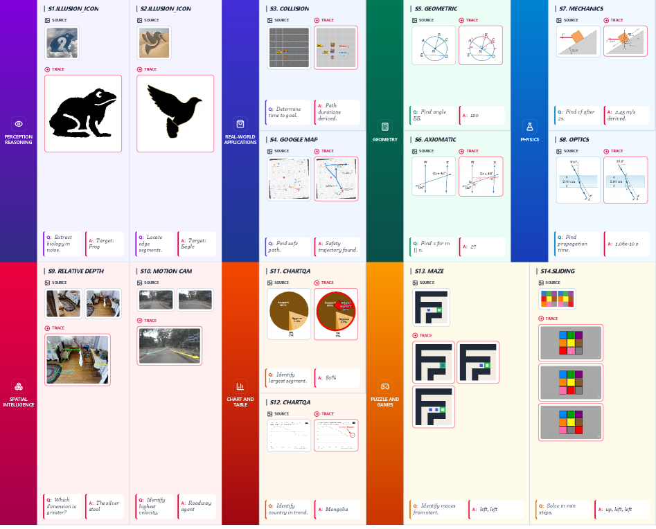

*图11：14 个代表性子任务的详细示例展示。每个示例包含源图像（Source）、模型生成的中间推理轨迹（Trace）和最终问答（Q&A）。覆盖了视觉错觉、碰撞检测、地图导航、几何推理、物理光学、深度估计、运动追踪、图表问答、迷宫和滑动拼图等多样化任务。*

## 五、深度分析：统一建模的困境与出路

### 5.1 "统一税"的根源

为什么引入生成能力会削弱理解能力？论文虽未给出完整的理论解释，但从实验数据中可以推断几个可能的原因：

**参数竞争**：在有限的模型容量中，生成任务（如图像去噪、流匹配）需要占用相当多的参数和表征空间。当这些资源被生成目标"征用"后，原本用于精细视觉判别的能力就被稀释了。MammothModa2 的案例最为典型——基于强大的 Qwen3-VL-8B（37.75），统一后暴跌近 8 个百分点。

**训练目标冲突**：理解任务需要模型学会"抽象和判断"，而生成任务需要模型学会"具象和还原"。这两种训练信号在梯度空间中可能存在对抗——一个推动模型关注高层语义，另一个推动模型保留低层像素细节。

**数据分布偏移**：统一训练通常会引入大量图像生成数据，这些数据的分布可能与理解任务的测试分布不一致，导致模型的判别边界发生偏移。

### 5.2 Bagel 为什么能成功？

在众多表现平平甚至退步的统一模型中，Bagel（+2.49/+2.75）是一个值得深入剖析的成功案例。

首先，Bagel 采用了 **Flow Matching** 作为图像生成范式，这种方法相比传统的扩散模型具有更稳定的训练动态和更好的样本效率。其次，Bagel 的训练策略可能在理解和生成目标之间实现了更好的平衡。从 RA/AL 数据来看，Bagel 在开源模型中拥有最高的对齐质量（RA 2.86 / AL 3.61），说明其生成模块确实学到了对推理有益的视觉表征。

更深层的原因可能在于 Bagel 的基座模型选择和训练数据组成。基于相关性分析的发现，基座模型的质量和预训练数据的多样性才是决定 G2U 增益的核心因素。Bagel 基于 LLaVA-OneVision（一个在多样化视觉任务上广泛训练的模型），这可能为后续的生成训练提供了更鲁棒的视觉理解基础。

### 5.3 视觉思维链的前景与局限

GtA 在迷宫和滑动拼图上的惊人表现（Bagel: 2.1% → 28.1% 迷宫，0.9% → 19.5% 滑动拼图）揭示了一个激动人心的方向：**视觉思维链（Visual Chain-of-Thought）**。

传统的文本思维链（Text CoT）让模型通过逐步生成推理步骤来解决复杂问题，但对于高度视觉化的空间推理任务，文字描述的效率和准确性远不及直接"画出来"。GtA 本质上是将 CoT 从文本空间扩展到了视觉空间——模型通过生成中间状态的图像来外化其推理过程。

然而，当前的视觉 CoT 还面临几个关键挑战：

1. **生成精度不足**：在几何和物理推理中，毫米级的角度偏差就可能导致完全错误的推理。当前模型的生成精度远未达到这一要求。
2. **错误级联**：一旦中间生成物出错，后续步骤会在错误的基础上继续推理，导致"雪崩效应"。这在 Ovis-U1 的 GtA 崩溃（32.15 → 24.19）中表现得淋漓尽致。
3. **适用范围窄**：目前只在需要多步状态追踪的空间变换任务中有效，对于需要抽象推理的感知和逻辑任务尚未见到收益。

### 5.4 对未来统一模型的启示

基于论文的全部发现，我们可以提炼出几条对未来统一模型研究的重要启示：

1. **数据优先于架构**：与其在 AR vs 扩散、端到端 vs 解耦等架构选择上反复纠结，不如投入更多精力策划高质量的理解-生成联合训练数据。RQ3 的相关性分析明确表明，基座模型的预训练数据分布比架构设计更能决定 G2U 的走向。

2. **选择性外化，而非一刀切**：GtA 不应该被无差别地应用于所有任务。一个理想的策略是让模型自主判断"何时需要画出来"——只在空间变换密集、需要多步状态追踪的任务中启用视觉外化，其他场景则直接推理。

3. **对齐质量是底线**：如果统一模型想通过 GtA 获得理解增益，首先要保证中间生成物的高对齐质量。低于某个阈值（从数据看大约 RA > 2.5、AL > 3.0）的生成不如不生成。

4. **轻量化生成模块**：为了减轻"统一税"，可以探索更轻量级的生成模块设计——不需要像素级完美的图像生成，只需要能产生对推理有帮助的结构化视觉表示即可。

## 六、Benchmark 细节中的"魔鬼"

### 6.1 任务设计的考量

UniG2U-Bench 的 30 个子任务的选择并非随意的。论文在 4.1 节阐述了两条核心设计原则：

1. **视觉变换密度光谱**：任务按照所需的隐式/显式视觉变换程度排列，从低（直接感知即可回答）到高（需要多步空间变换才能回答）
2. **生成假说可检验性**：每个任务都伴随一个可以通过 GtA 验证的"生成假说"——即如果模型能正确生成某种中间视觉表示，理论上应该有助于回答该问题

这种设计使得基准不仅能测量"好不好"，还能诊断"为什么好/不好"。

### 6.2 评估的公平性

一个值得注意的细节是论文如何确保评估的公平性。由于不同统一模型的基座 VLM 各不相同（Qwen2.5-VL、LLaVA-OneVision、DeepSeek-V2 等），直接比较模型间的绝对性能是不公平的。因此，论文始终以 **G2U 增益 Δ** 作为核心度量，衡量的是统一训练带来的相对变化而非绝对能力。

此外，论文还特别评估了冻结骨干网络（Frozen Backbone）的统一模型（Table 8），发现即使不修改理解模块的权重，仅通过添加生成侧分支，部分模型也出现了性能波动。这进一步说明了统一架构中理解和生成通路之间的微妙交互。

## 七、总结与展望

UniG2U-Bench 为当前火热的统一多模态建模研究泼了一盆清醒的冷水，同时也指出了前进的方向：

**三条核心结论：**

1. **"统一税"是当前的常态**：将生成能力塞入理解模型，在大多数情况下会损害原有的理解性能。这不是某个模型的偶然失误，而是当前训练范式下的系统性现象。

2. **孤岛般的增益**：在空间智能、视觉错觉和多步状态追踪（迷宫、滑动拼图）等特定任务中，生成训练确实带来了结构性的提升。这些"孤岛"指示了生成能力对理解真正有益的场景——那些需要强空间感知和状态外化的任务。

3. **基座模型和数据比架构更重要**：模型的 G2U 行为主要由其基座 VLM 的预训练先验决定，而非统一架构的具体设计。这一发现对研究资源的分配具有重要的指导意义。

**展望未来**，论文指出了几个有前景的方向：开发更精准的任务自适应推理策略（模型自主判断何时启用视觉 CoT）、设计减轻参数竞争的轻量化生成模块、以及策划更高质量的理解-生成联合训练数据集。统一多模态建模的愿景依然美好，但从"美丽幻觉"到"可靠现实"，还有很长的路要走。

---

**个人点评**：这是一篇扎实的实证研究论文。35+ 个模型、3000 个样本、30 个子任务的评估规模在同类工作中属于顶级。更难能可贵的是，论文没有止步于"跑分"，而是通过 RQ3 的相关性分析和 RQ4 的对齐质量解剖，深入挖掘了 G2U 增益背后的结构性成因。RA/AL 两个诊断指标的设计尤为巧妙，为后续研究提供了一套可操作的分析工具。如果说有什么遗憾的话，论文在"如何修复统一税"这个方向上的探索还比较有限——指出了问题，但解决方案主要停留在建议层面。期待后续工作能在这个方向上取得突破。
